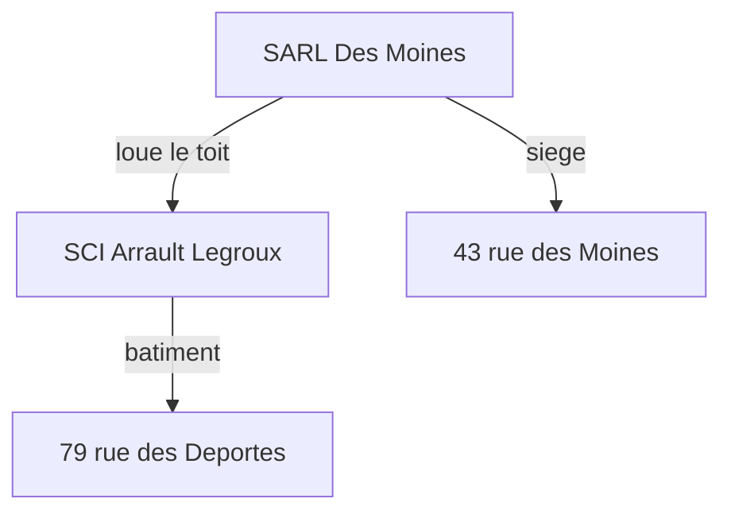
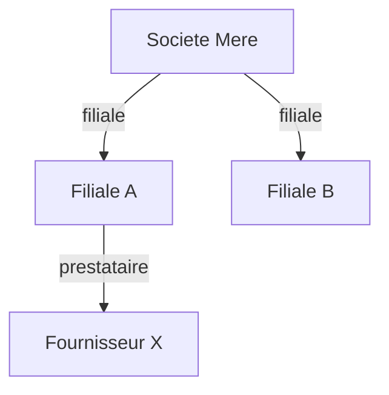

# Audit 3 — Exemples impersonnels & biais métier hardcodés

**Date** : 3 mai 2026 (nuit)
**Contexte** : préparation onboarding Charlotte (tenant `juillet`,
métier événementiel scénographique B2B, ≠ photovoltaïque).
**Objectif** : recenser toutes les références business spécifiques
à Guillaume / Couffrant Solar / photovoltaïque qui apparaîtraient
dans l'expérience d'un nouveau tenant.

---

## 🚨 Synthèse exécutive

```
TOTAL : 17 zones critiques identifiées
        sur 6 fichiers principaux

CRITICITÉ :
  🔴 BLOQUANT (Charlotte voit "Couffrant Solar")  :  6 zones
  🟠 GÊNANT  (placeholders/exemples PV inadaptés) :  9 zones
  🟢 INTERNE (commentaires code, pas exposé)      :  2 zones

ESTIMATION : 3-5 heures de travail méthodique
```
</content>


---

## 🔴 ZONE 1 — Prompt système v2 (le PLUS critique)

### `app/routes/raya_agent_core.py`, ligne 74

**TEXTE ACTUEL** :
```python
return f"""Tu es Raya, IA de {display_name} chez Couffrant Solar (photovoltaique, Romorantin-Lanthenay).
Tu parles au feminin, tutoiement.

Tu as acces a l ensemble des donnees de l entreprise via tes outils :
Odoo (clients, devis, factures), SharePoint, mails analyses, graphe
semantique des relations, historique des conversations, web.
```

**PROBLÈMES** :
1. `Couffrant Solar (photovoltaique, Romorantin-Lanthenay)` → en dur
2. `Odoo (clients, devis, factures)` → Charlotte n'a pas Odoo
3. `SharePoint` → Charlotte est sur Google Drive

**IMPACT POUR CHARLOTTE** :
Raya va se présenter comme "IA de Charlotte chez Couffrant Solar
(photovoltaique, Romorantin-Lanthenay)" et lister Odoo + SharePoint
parmi ses outils, tout en n'y ayant pas accès. Désastre commercial
total au premier message.

**SOLUTION** :
Charger dynamiquement le profil tenant depuis `tenants.metadata` ou
une table `tenant_profile` qui contient :
- nom de société
- secteur d'activité (1 phrase)
- localisation (optionnel)
- liste des connecteurs réellement actifs
- ton (féminin/masculin/neutre, tutoiement/vouvoiement)

Pour Charlotte :
- `company_name` = "juillet"
- `activity` = "agence événementielle B2B scénographique"
- `gender` = "au feminin"
- `address_form` = "tutoiement"
- `connectors_description` = "Gmail, Google Drive, Google Agenda, Lab Events"

---

### `app/routes/raya_agent_core.py`, lignes 95-96 (exemple dans le prompt)

**TEXTE ACTUEL** :
```
"Je n arrive pas a obtenir les montants detailles des
devis car sale.order.line n est pas expose par l API Odoo. Il
faudrait demander a OpenFire d ouvrir ce modele."
```

**PROBLÈME** : exemple ultra-spécifique Odoo + nom de l'éditeur "OpenFire".

**SOLUTION** : exemple générique :
```
"Cette donnee n est pas accessible par mes outils actuels. Voici
ce que j ai pu rassembler : [contexte disponible]."
```

---

### `app/routes/raya_agent_core.py`, lignes 100-110 (exemple Mermaid)

**TEXTE ACTUEL** :


**PROBLÈME** : exemple basé sur le **vrai** montage juridique de Guillaume.

**SOLUTION** :


---

### `app/routes/raya_agent_core.py`, ligne 81 (exemple signature)

**TEXTE ACTUEL** : `(pas de "Cordialement, Guillaume", pas de bloc de contact)`

**SOLUTION** : `(pas de formule "Cordialement, [Prenom]", pas de bloc de contact)` ou utiliser `{display_name}`.

---

### `app/routes/raya_agent_core.py`, ligne 490 (mode approfondissement)

**TEXTE ACTUEL** : `"(tes tools Odoo, mails, SharePoint sont disponibles)"`

**SOLUTION** : `"(tes tools de recherche dans les sources de l entreprise sont disponibles)"`

---

## 🔴 ZONE 2 — Analyseur de mails entrants

### `app/ai_client.py`, ligne 178

**TEXTE ACTUEL** :
```python
system_prompt = f"""Tu es Raya, l'assistante de Couffrant Solar.
```

**IMPACT POUR CHARLOTTE** : tous ses mails analysés en arrière-plan auraient un contexte erroné.

**SOLUTION** :
```python
profile = get_tenant_profile(tenant_id)
system_prompt = f"""Tu es Raya, l'assistante de {profile.company_name}.
```

---

### `app/ai_client.py`, lignes 96-104 (fallbacks catégories PV)

**TEXTE ACTUEL** :
```python
fallbacks = {
    "raccordement": ["enedis", "consuel", "raccordement"],
    "chantier":     ["chantier", "planning", "installation"],
    ...
}
```

**SOLUTION** : retirer les fallbacks PV, laisser une liste vide si pas de keywords configurés.

---

## 🔴 ZONE 3 — Catégories par défaut

### `app/ai_prompts.py`, lignes 20-23

**TEXTE ACTUEL** :
```python
_DEFAULT_CATEGORIES = [
    "raccordement", "consuel", "chantier", "commercial", "financier",
    "fournisseur", "reunion", "securite", "interne", "notification", "autre"
]
```

**SOLUTION** :
```python
_DEFAULT_CATEGORIES = [
    "commercial", "financier", "interne", "notification", "autre"
]
```

---

## 🔴 ZONE 4 — Garde-fous prompt

### `app/routes/prompt_guardrails.py`, lignes 30, 55, 56

**EXEMPLES PROBLÉMATIQUES** :
- `"Tu veux dire X@couffrant-solar.fr ?"`
- `"__guillaume@couffrant-solar.fr__"`
- `"guillaume@couffrant-solar.fr"`

**SOLUTION** : remplacer par `prenom.nom@societe.fr`.

---

### `app/routes/prompt_guardrails.py`, lignes 67-71

**TEXTE ACTUEL** :
```
BON : "Tu veux que je mette le mail de Francine a la corbeille ?"
MAUVAIS : "le mail de Francine Coulet concernant l'augmentation de
puissance du chateau et le raccordement ENEDIS recu le 14 avril ?"
```

**SOLUTION** : exemple neutre B2B :
```
MAUVAIS : "le mail de Pierre Dupont concernant la proposition
commerciale recue le 14 avril ?"
```

---

## 🟠 ZONE 5 — Templates de pages

### `app/templates/user_settings.html`, lignes 582-605

**TEXTE ACTUEL** :
```html
<div class="avatar-large">GP</div>
<div id="profileName">Guillaume Perrin</div>
<div id="profileEmail">guillaume@couffrant-solar.fr</div>
<span id="badgeTenantName">Couffrant Solar</span>
<input id="inputDisplayName" value="Guillaume">
<input id="inputPhone" value="+33 6 23 45 67 89">
```

**PROBLÈME** : valeurs en dur. Charlotte voit "Guillaume Perrin" pendant le flash de chargement, plus un faux numéro de tel.

**SOLUTION** : initialiser à vide ou placeholders neutres :
```html
<div class="avatar-large">--</div>
<div id="profileName">Chargement...</div>
<div id="profileEmail">...</div>
<span id="badgeTenantName">--</span>
<input id="inputDisplayName" value="">
<input id="inputPhone" value="">
```

---

### `app/templates/user_settings.html`, ligne 2764

**TEXTE ACTUEL** :
```javascript
const url = prompt('URL du lien (ex: https://couffrant-solar.fr) :');
```

**SOLUTION** :
```javascript
const url = prompt('URL du lien (ex: https://votre-societe.fr) :');
```

---

### `app/templates/admin_panel.html`, lignes 239, 260

**TEXTE ACTUEL** :
```html
<input placeholder="ex: guillaume" value="guillaume">
```

**STATUT** : admin panel super-admin (toi). Faible impact.

**SOLUTION** : retirer `value="guillaume"`, garder `placeholder="ex: prenom"`.

---

## 🟠 ZONE 6 — Configuration Drive (placeholders)

### Fichiers concernés :
- `app/templates/_drive_config_modal_snippet.html` (lignes 55, 65, 82-84, 105, 117, 131)
- `app/templates/admin_connexions.html` (lignes 365, 394-396, 431)
- `app/templates/tenant_panel.html` (lignes 76, 558, 587-589, 623)

**TEXTE ACTUEL (multiples occurrences)** :
```html
<input placeholder="ex: Drive Direction">
<input placeholder="ex: Comptabilite">
<input placeholder="ex: Drive Direction/RH">
<input placeholder="ex: Drive Direction/RH/contrat.docx">
<input placeholder="ex: RH confidentiel">

Inclus Comptabilite = tout indexe
Exclus Comptabilite/Salaires = sauf ce sous-dossier
Inclus Comptabilite/Salaires/Public = sauf ce sous-sous-dossier
```

**PROBLÈME** : tous les exemples reflètent ton organisation Drive.

**SOLUTION** : remplacer par des exemples génériques :
```html
<input placeholder="ex: Documents">
<input placeholder="ex: Projets">
<input placeholder="ex: Projets/2026">
<input placeholder="ex: Projets/2026/draft.docx">
<input placeholder="ex: Documents internes">

Inclus Documents = tout indexe
Exclus Documents/Confidentiel = sauf ce sous-dossier
Inclus Documents/Confidentiel/Public = sauf ce sous-sous-dossier
```

⚠️ **NOTE** : ce point est déjà connu côté produit (mémoire Guillaume sur audit dédié).

---

## 🟠 ZONE 7 — Configuration Drive backend

### `app/routes/admin_drive_config.py`, ligne 270

**TEXTE ACTUEL** :
```python
"folder_path": "Drive Direction/RH",
"reason": "RH confidentiel"
```

**SOLUTION** : `"Documents/Confidentiel"`, `"reason": "Documents internes"`.

---

## 🟠 ZONE 8 — Localisations / météo

### `app/routes/raya_tools.py`, ligne 214 + `raya_tool_executors.py`, ligne 329

**TEXTE ACTUEL** :
```python
"description": "Ville ou code postal. Par defaut Romorantin-Lanthenay."
"location": inp.get("location", "Romorantin-Lanthenay"),
```

**SOLUTION** : retirer le default Romorantin. Si pas de paramètre, ne pas faire l'appel ou utiliser la localisation du tenant.

---

## 🟠 ZONE 9 — Description des tools (BLOQUANT pour Charlotte)

### `app/routes/raya_tools.py`, lignes 102-110 (TOOL_SEARCH_DRIVE)

**TEXTE ACTUEL** :
```python
"description": (
    "Recherche semantique dans les fichiers SharePoint (photos, PDF, docs "
    "techniques, plans). ..."
),
```

**PROBLÈME** : "SharePoint" cité en dur. Charlotte est sur Google Drive.

**SOLUTION** :
```python
"description": (
    "Recherche semantique dans les fichiers Drive de l utilisateur "
    "(photos, PDF, documents). Le backend route automatiquement vers "
    "le bon connecteur (SharePoint, Google Drive, OneDrive selon le "
    "tenant)."
),
```

Idem pour `TOOL_READ_DRIVE_FILE` (175), `TOOL_MOVE_DRIVE_FILE` (440), `TOOL_CREATE_DRIVE_FOLDER` (454).

---

### `app/routes/raya_tools.py`, lignes 240-250 (TOOL_SEND_MAIL)

**TEXTE ACTUEL** :
```python
"description": (
    "Prepare l envoi d un mail (Outlook par defaut, Gmail si specifie). "
    ...
    "(pas de 'Cordialement, Guillaume' ni bloc de contact). "
```

**SOLUTION** : default provider depend du tenant (Charlotte = gmail).

---

### Filtrage dynamique des tools (CRITIQUE)

**PROBLÈME** : `get_tools_for_user(username, tenant_id)` retourne TOUJOURS la liste complète. Charlotte se voit donc proposer :
- `TOOL_SEARCH_ODOO` alors qu'elle n'a pas Odoo
- `TOOL_GET_CLIENT_360` (basé Odoo)
- `TOOL_SEND_TEAMS_MESSAGE` alors qu'elle n'a pas Teams (?)

**SOLUTION** : filtrer selon les connecteurs actifs :
```python
def get_tools_for_user(username, tenant_id):
    connections = get_active_connections(tenant_id)  # liste des tool_types
    tools = []
    for tool in RAYA_TOOLS:
        # Filtrage par dépendance
        if tool["name"] in ("search_odoo", "get_client_360") and "odoo" not in connections:
            continue
        if tool["name"] == "send_teams_message" and "teams" not in connections:
            continue
        tools.append(tool)
    return tools
```

**IMPACT** : sans ce filtrage, Charlotte verra Raya tenter d'utiliser Odoo, échouer, et lui répondre dans un état dégradé.

---

## 🟢 ZONE 10 — Commentaires de code (non exposés)

Fichiers avec mention "Couffrant" en commentaires uniquement (pas exposé) :
- `app/connectors/odoo_client_360.py` (4 commentaires)
- `app/seeding.py:9` (docstring)
- `app/database_migrations.py:1458`
- `app/routes/admin_oauth.py:61`

**ACTION** : aucune urgente. À nettoyer plus tard.

---

## 🟢 ZONE 11 — Page legal et templates email

### `app/templates/legal.html`, lignes 22-24, 127

**TEXTE ACTUEL** : "Couffrant Solar — Représenté par Guillaume Perrin — couffrant-solar.fr"

**STATUT** : Couffrant Solar est l'**éditeur** de Raya. Légitime.

**ACTION** : aucune.

---

### `app/routes/reset_password_templates.py`

**TEXTE ACTUEL** : "Couffrant Solar — Assistant IA" dans les emails reset.

**ACTION** : à terme, remplacer par "Raya — Assistant IA". Pas urgent.

---

## 📋 Plan d'action prioritisé

### 🔴 Sprint critique (AVANT premier login Charlotte)

```
1. Créer table tenant_profile (ou champ metadata JSONB sur tenants)
   contenant : company_name, activity, location, gender,
   address_form, default_mail_provider
   → Migration DB + remplir pour couffrant_solar et juillet
   → ~1h

2. Refactor raya_agent_core.py (prompt v2) — ZONE 1
   → 5 modifs ciblées dans _build_agent_system_prompt
   → ~30 min

3. Refactor ai_client.py — ZONE 2
   → prompt analyse mails dépend du tenant
   → ~30 min

4. Refactor prompt_guardrails.py — ZONE 4
   → exemples génériques
   → ~15 min

5. Refactor user_settings.html valeurs initiales — ZONE 5
   → pas de pré-remplissage Guillaume
   → ~15 min

6. Filtrage des tools selon connecteurs actifs — ZONE 9
   → CRITIQUE
   → get_tools_for_user filtre les tools Odoo/Teams si pas connecté
   → ~45 min

TOTAL SPRINT CRITIQUE : 3-4 heures
```

### 🟠 Sprint suivant (semaine 2)

```
7. Placeholders Drive config — ZONES 6, 7
   → ~30 min (recherche-remplace dans 3 fichiers)

8. Localisations Romorantin — ZONE 8
   → ~10 min

9. Catégories par défaut — ZONE 3
   → ~5 min

TOTAL : ~45 min
```

### 🟢 Plus tard (cosmétique)

```
10. Nettoyage commentaires code — ZONE 10
11. Branding éditeur dans templates email — ZONE 11
```

---

## 🎯 Estimation totale

```
Sprint critique : 3-4 heures (BLOQUANT)
Sprint suivant  : 45 min
Plus tard       : 1-2 heures (cosmétique)

TOTAL ~ 6 heures pour neutraliser tous les biais.
```

---

## ⚠️ Limites de cet audit

- Audit basé sur grep + lecture manuelle. Possible que certains biais soient passés inaperçus.
- Pas testé en runtime : possible que certains fichiers ne soient plus appelés (code mort), ou au contraire que d'autres exemples PV soient injectés depuis la DB (insights, hot_summary).
- **Recommandation** : après les fixes, lancer une vraie session de test avec un user de juillet, et capturer le system prompt complet envoyé à Anthropic pour vérifier qu'il n'y a plus aucune mention de Couffrant/photovoltaïque/Romorantin.
</content>